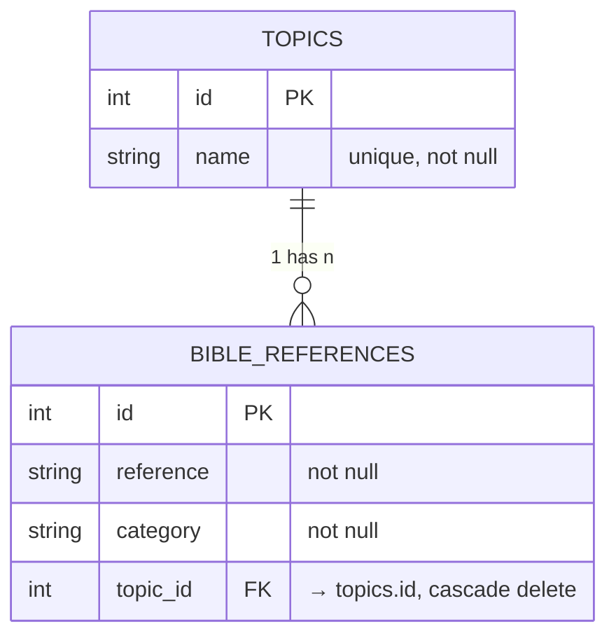

# Dufour Bible Topic Search

A lightweight web application for searching Bible references by topic. Authenticated users can enter a theological theme and receive matching Bible verses grouped into four categories.

## What it does

The app parses a collection of HTML source files, extracts Bible references, and stores them in a SQLite database. Through a simple web interface, users can search for topics and get results organised by:

- Altes Testament (Old Testament)
- Propheten (Prophets)
- Neues Testament (New Testament)
- Evangelien (Gospels)

Access is protected by a single password login. There is no user management — one shared password for all users.

## Project structure

```
backend/
├── main.py          # FastAPI entry point, route registration, static file serving
├── database.py      # SQLAlchemy + SQLite setup, session management
├── models.py        # ORM models: Topic, BibleReference
└── routers/
    ├── search.py    # GET /search?q= endpoint
    └── auth.py      # POST /login endpoint
frontend/
├── index.html       # Redirects to login
├── login.html       # Password login page
└── search.html      # Search interface with categorised results
data/                # HTML source files (not in repo — see Data Pipeline)
scripts/
└── parse_html.py    # Parses HTML files and writes to SQLite
tests/
├── test_models.py
├── test_auth.py
├── test_parser.py
└── test_search.py
.env                 # Local secrets (never commit)
.gitignore
requirements.txt
```

## UML

```mermaid
%%{init: {'theme': 'base', 'themeVariables': {'primaryColor': '#dcfce7', 'primaryBorderColor': '#16a34a', 'secondaryColor': '#dbeafe', 'tertiaryColor': '#fef9c3'}}}%%
classDiagram
direction TB

%% ═══════════════════════════════════════════════════════════════
%%  FRONTEND · HTML-Seiten
%% ═══════════════════════════════════════════════════════════════

namespace Frontend_HTML {
    class index_html {
        <<HTML-Seite>>
        +meta http-equiv refresh sofort
        +weiterleitenZuLogin() void
    }

    class login_html {
        <<HTML-Seite>>
        +Passwort-Formular
        +onSubmit_POST_login() void
        +zeigeFehlermeldung() void
        +weiterleitenZuSearch() void
    }

    class search_html {
        <<HTML-Seite>>
        +Sucheingabe-Formular
        +checkAuth() Promise~bool~
        +goLogin() void
        +onSubmit_GET_search(q) void
        +renderResults(data) void
        +zeigeStatusFehler(msg) void
    }
}

%% ═══════════════════════════════════════════════════════════════
%%  BACKEND · Einstiegspunkt & Kern
%% ═══════════════════════════════════════════════════════════════

namespace Backend_Core {
    class main_py {
        <<FastAPI App>>
        +app: FastAPI
        +require_auth(request) void
        -pruefSessionCookie(request) bool
        -raise401_NichtAuthentifiziert() void
        +registriereRouter_search() void
        +registriereRouter_auth() void
        +mountStaticFiles_frontend() void
    }

    class database_py {
        <<SQLAlchemy Engine>>
        +DATABASE_URL: str
        +engine: Engine
        +SessionLocal: sessionmaker
        +Base: DeclarativeBase
        +get_session() Generator~Session~
        -oeffneSession() Session
        -schliessSessionNachRequest() void
        +create_all() void
    }

    class models_py {
        <<ORM Modelle>>
        +Topic: id, name
        +Topic.references: relationship
        +BibleReference: id, reference, category, topic_id
        +BibleReference.topic: relationship
        +cascade_delete_orphan() void
    }
}

%% ═══════════════════════════════════════════════════════════════
%%  BACKEND · Router
%% ═══════════════════════════════════════════════════════════════

namespace Backend_Router {
    class router_auth_py {
        <<Router /login>>
        +LoginRequest: password str
        +POST_login(request: LoginRequest) JSONResponse
        -ladePasswortAusEnv() str
        -vergleichePasswort(eingabe, env) bool
        -raise401_FalschesPasswort() void
        -setzeHttpOnlyCookie(session, authenticated) void
    }

    class router_search_py {
        <<Router /search>>
        +GET_search(q: str min_length=1) dict
        -oeffneSession() Session
        -sucheTopicILIKE(q) Topic
        -ladeReferenzen(topic_id) List~BibleReference~
        -gruppiereNachKategorie(refs) dict
        -returnEmptyResultWennKeinTopic() dict
        -schliessSession() void
    }
}

%% ═══════════════════════════════════════════════════════════════
%%  DATEN-PIPELINE · Parser-Skript
%% ═══════════════════════════════════════════════════════════════

namespace Datenpipeline {
    class parse_html_py {
        <<Skript scripts/>>
        +BIBLE_BOOKS: List~str~
        +BIBLE_REF_RE: Pattern
        +EVANGELIEN: Set~str~
        +NT: Set~str~
        +PROPHETEN: Set~str~
        +_classify(book) str
        +_normalize_reference(text) str
        +parse_html(html_content) List~dict~
        -extrahiereH1AlsTopic() str
        -iteriereParagraphen() void
        -matcheRegex_BIBLE_REF_RE() Match
        -dedupeInnerhalb_seen_set() void
        +save_to_db(data) void
        -create_all_Tabellen() void
        -pruefeTopicDuplikat() Topic
        -session_flush_fuer_ID() void
        -session_commit_rollback() void
        +ladeHTMLDateien_main() void
        -versuche_UTF8_danach_Latin1() str
    }
}

%% ═══════════════════════════════════════════════════════════════
%%  DATENBANK · Tabellen
%% ═══════════════════════════════════════════════════════════════

namespace Datenbank_Tabellen {
    class topics {
        <<Tabelle>>
        +id: INT PK AUTO_INCREMENT
        +name: TEXT UNIQUE NOT NULL
    }

    class bible_references {
        <<Tabelle>>
        +id: INT PK AUTO_INCREMENT
        +reference: TEXT NOT NULL
        +category: TEXT NOT NULL
        +topic_id: INT FK topics.id
        %% category: Altes Testament | Propheten
        %% Neues Testament | Evangelien
    }
}

%% ═══════════════════════════════════════════════════════════════
%%  TESTS
%% ═══════════════════════════════════════════════════════════════

namespace Tests {
    class test_auth_py {
        <<pytest>>
        +client: Fixture~TestClient~
        +test_login_success()
        +test_login_wrong_password()
        +test_search_without_cookie_returns_401()
        +test_search_with_cookie_returns_200()
    }

    class test_models_py {
        <<pytest>>
        +db_session: Fixture~InMemorySQLite~
        +test_create_topic()
        +test_create_bible_reference()
        +test_topic_references_relationship()
        +test_topic_unique_constraint()
    }

    class test_parser_py {
        <<pytest>>
        +db_session: Fixture~InMemorySQLite~
        +test_parse_html_returns_list()
        +test_parse_html_fields_not_empty()
        +test_parse_html_empty_html()
        +test_save_to_db_creates_bible_reference()
        +test_save_to_db_skips_duplicate_topic()
        +test_parse_html_extracts_bible_references()
        +test_parse_html_dedupes_within_file()
        +test_parse_html_skips_topic_only_paragraphs()
    }

    class test_search_py {
        <<pytest>>
        +client: Fixture~TestClient+Auth~
        -_insert_test_data() void
        +test_search_existing_topic()
        +test_search_nonexistent_topic()
        +test_search_case_insensitive()
        +test_search_partial_match()
    }
}

%% ═══════════════════════════════════════════════════════════════
%%  BEZIEHUNGEN · Frontend intern
%% ═══════════════════════════════════════════════════════════════

index_html ..> login_html : meta-refresh Weiterleitung
login_html ..> search_html : JS redirect nach Login-Erfolg
search_html ..> login_html : goLogin() bei 401

%% ═══════════════════════════════════════════════════════════════
%%  BEZIEHUNGEN · Frontend → Backend (REST)
%% ═══════════════════════════════════════════════════════════════

login_html ..> router_auth_py : POST /login JSON-Body
search_html ..> router_search_py : GET /search?q= · Cookie session

%% ═══════════════════════════════════════════════════════════════
%%  BEZIEHUNGEN · Backend intern
%% ═══════════════════════════════════════════════════════════════

main_py --> router_auth_py : include_router
main_py --> router_search_py : include_router + Depends(require_auth)
main_py --> database_py : create_all() beim Start

router_auth_py --> database_py : lädt APP_PASSWORD via dotenv
router_search_py --> database_py : get_session()
router_search_py --> models_py : Topic · BibleReference Queries

database_py --> models_py : ORM-Schema · Base

%% ═══════════════════════════════════════════════════════════════
%%  BEZIEHUNGEN · Parser → DB
%% ═══════════════════════════════════════════════════════════════

parse_html_py --> database_py : get_session() · create_all()
parse_html_py --> models_py : Topic · BibleReference erstellen

%% ═══════════════════════════════════════════════════════════════
%%  BEZIEHUNGEN · ORM → Tabellen
%% ═══════════════════════════════════════════════════════════════

models_py --> topics : ORM-Mapping
models_py --> bible_references : ORM-Mapping
topics "1" --> "n" bible_references : cascade delete-orphan

%% ═══════════════════════════════════════════════════════════════
%%  BEZIEHUNGEN · Tests
%% ═══════════════════════════════════════════════════════════════

test_auth_py ..> router_auth_py : testet POST /login
test_auth_py ..> router_search_py : testet GET /search Auth
test_models_py ..> models_py : testet ORM-Modelle
test_parser_py ..> parse_html_py : testet parse_html · save_to_db
test_search_py ..> router_search_py : testet GET /search Logik
test_search_py ..> models_py : fügt Testdaten ein

```



## Database schema

Two tables with a one-to-many relationship:

**topics**



## Setup

**1. Clone and create a virtual environment**

```bash
git clone <repo-url>
python -m venv .venv
source .venv/bin/activate        # Linux/macOS
.venv\Scripts\activate           # Windows
```

**2. Install dependencies**

```bash
pip install -r requirements.txt
```

**3. Create `.env`**

```env
APP_PASSWORD=your_password_here
DATABASE_URL=sqlite:///./dufour.db
```

**4. Add HTML source files**

Place the HTML topic files into the `data/` directory. Or use the data in the repository.

**5. Parse HTML and populate the database**

```bash
python scripts/parse_html.py
```

This reads all `.html` files from `data/`, extracts Bible references using regex matching against a catalogue of German Bible book abbreviations, classifies each reference into one of the four categories, and writes everything to `dufour.db`.

**6. Start the server**

```bash
uvicorn backend.main:app --reload
```

Open [http://localhost:8000](http://localhost:8000) — you will be redirected to the login page.

## API

**`POST /login`**

```json
{ "password": "your_password" }
```

Returns a `session=authenticated` cookie on success. All subsequent requests must include this cookie.

**`GET /search?q=<topic>`**

Case-insensitive partial match against topic names. Returns:

```json
{
  "topic": "Glaube",
  "results": {
    "Altes Testament": ["Gen 15,6"],
    "Propheten": [],
    "Neues Testament": ["Röm 3,28", "Hebr 11,1"],
    "Evangelien": ["Joh 3,16"]
  }
}
```

Requires the session cookie. Returns `401` if not authenticated.

## Data pipeline

```
data/*.html
    └── BeautifulSoup4 parser
        └── Regex match against German Bible abbreviations
            └── Classify by book (Evangelien / NT / Propheten / AT)
                └── Deduplicate
                    └── Write to SQLite via SQLAlchemy
```

The parser handles both UTF-8 and Latin-1 encoded files. Multi-word abbreviations (e.g. `1 Petr`, `2 Kor`) are matched before single-word ones to avoid partial matches.

## Running tests

```bash
pytest
```

Tests cover models, authentication, the HTML parser, and the search endpoint.

## Deployment

The database is generated locally and copied to the server manually:

```bash
python scripts/parse_html.py       # generate dufour.db locally
scp dufour.db user@server:/path/to/dufour/
ssh user@server "cd /path/to/dufour && git pull && uvicorn backend.main:app"
```

`dufour.db` is intentionally excluded from the repository.

## Dependencies

```
fastapi
uvicorn
sqlalchemy
beautifulsoup4
python-dotenv
pytest
httpx
```
